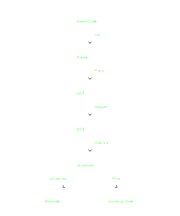

# Compilation Pipeline

## Lex

Tokenization of source code.

## Parse

Parsing from token stream to AST (Abstract Syntax Tree).

## Analyze

Semantic anylysis and generation of the SST (Semantic Structure Tree).
Function and variable resolution are performed in this stage.

## Compile

Translation from SST to linear instructions. 

## Print

The print stage translated instructions into readable text.

## Assemble

The Assemble stage converts instructions into bytecode.
Jumps are linked in this step.